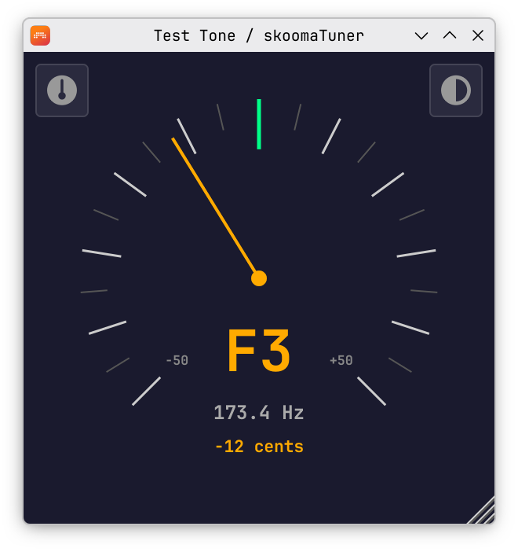
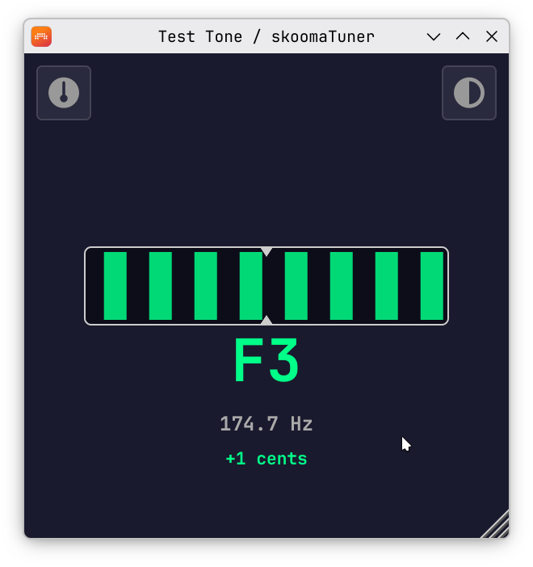
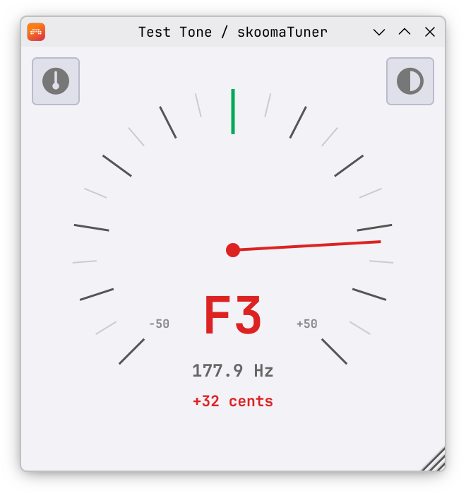
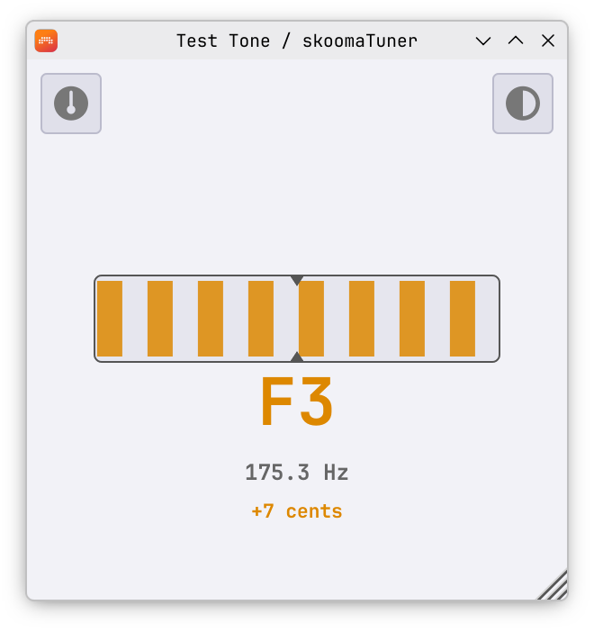

# SkoomaTuner

A minimal VST3 tuner plugin.

<table><tr>
<td></td>
<td></td>
<td></td>
<td></td>
</tr></table>

Needle and strobe modes, dark and light themes. Spring-damped needle physics.

## Install

Download the VST3 for your platform from the [Releases](https://github.com/skoomabwoy/SkoomaTuner/releases) page. Extract and copy the `.vst3` bundle to your VST3 folder.

Supported platforms: **Linux**, **Windows**, **macOS**.

<details>
<summary>Alternatively, you can build from source</summary>

CMake 3.22+, C++17 compiler. All dependencies (JUCE, FFTW3) are fetched automatically.

```bash
cmake -B build -DCMAKE_BUILD_TYPE=Release
cmake --build build -j$(nproc)
```

Copy `build/SkoomaTuner_artefacts/Release/VST3/SkoomaTuner.vst3/` to your VST3 folder.

</details>

## Credits

Pitch detection from [StompTuner](https://github.com/brummer10/StompTuner) by Hermann Meyer (brummer10), derived from [Guitarix](https://guitarix.org/). NSDF algorithm based on work by Philip McLeod (Tartini). Resampler: [zita-resampler](https://kokkinizita.linuxaudio.org/linuxaudio/) by Fons Adriaensen. Icons: [Font Awesome Free](https://fontawesome.com/) (SIL OFL 1.1).

## License

GPL-3.0
